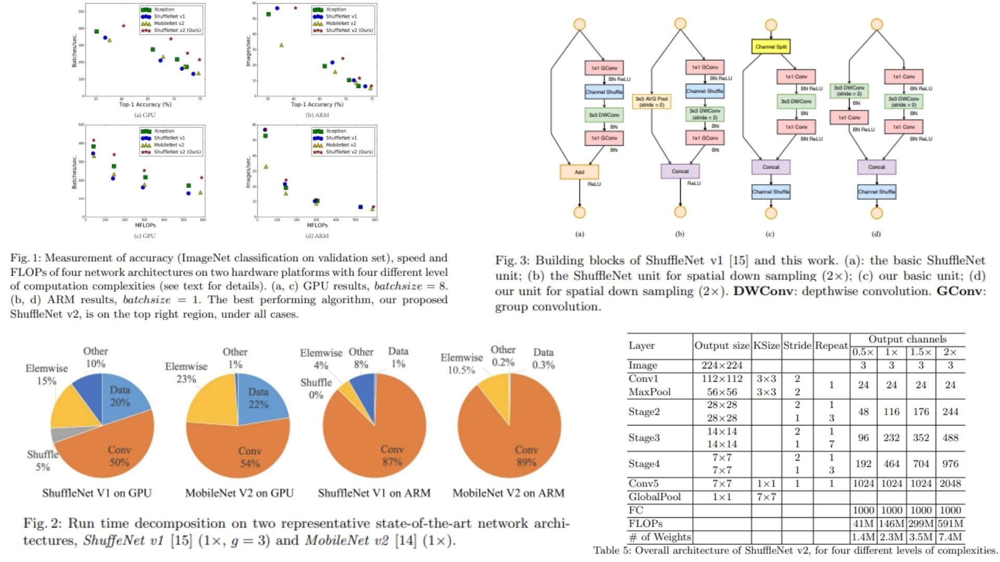

# 🕦 ShuffleNetV2-Replication — Efficient CNN Design for Real-Time Inference

This repository provides a **faithful Python replication** of the **ShuffleNet V2 architecture** for efficient convolutional neural network design.  
It implements the full pipeline described in the original paper, including **channel split, channel shuffle, lightweight convolutions, and stage-wise feature aggregation**.

Paper reference: *ShuffleNet V2: Practical Guidelines for Efficient CNN Architecture Design*  https://arxiv.org/abs/1807.11164

---

## Overview ✨



> The architecture is designed based on **real runtime behavior rather than FLOPs**, focusing on memory access cost, degree of parallelism, and hardware-aware design principles.

Key points:

- Input channels are split as $$C \rightarrow (C/2, C/2)$$  
- One branch is identity, the other performs lightweight transformations  
- Core block: 1×1 Conv → 3×3 DWConv → 1×1 Conv  
- Features are concatenated and mixed via channel shuffle  
- Downsampling uses a modified dual-branch structure (stride = 2)

---

## Core Math 📐

**Channel split operation:**

$$
X = [X_1, X_2], \quad X_1, X_2 \in \mathbb{R}^{C/2}
$$

**Depthwise convolution cost:**

$$
\mathcal{F}_{DW} \propto hwC
$$

**Standard convolution cost:**

$$
\mathcal{F} = hwC_{in}C_{out}
$$

**Channel shuffle:**

$$
\text{Shuffle}(X) = \text{reshape} \rightarrow \text{transpose} \rightarrow \text{flatten}
$$

**Key insight:**

$$
\text{Latency} \neq \text{FLOPs}
$$

---

## Why ShuffleNet V2 Matters ⚡

- Built for **real hardware latency optimization**, not only FLOPs 📉  
- Reduces **memory access cost bottlenecks** 🧠  
- Avoids excessive group convolution and fragmentation  
- Keeps accuracy while improving inference speed 🚀  
- Suitable for **mobile and embedded deployment**

---

## Repository Structure 🏗️

```bash
ShuffleNetV2-Replication/
├── src/
│   ├── blocks/
│   │   ├── conv.py             
│   │   ├── shuffle.py          
│   │   └── split.py            
│   │
│   ├── modules/
│   │   ├── shufflenet_unit.py 
│   │   ├── downsample_unit.py  
│   │   └── stage_builder.py    
│   │
│   ├── model/
│   │   └── shufflenetv2.py     
│   │
│   ├── head/
│   │   └── classifier.py        
│   │
│   └── config.py                
│
├── images/
│   └── figmix.jpg            
│
├── requirements.txt
└── README.md
```

---

## 🔗 Feedback

For questions or feedback, contact:  
[barkin.adiguzel@gmail.com](mailto:barkin.adiguzel@gmail.com)
